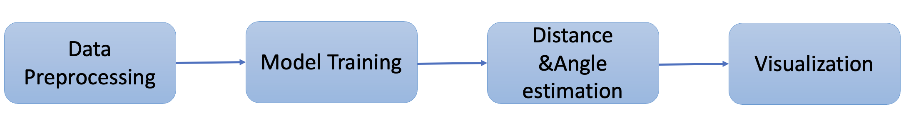

End-to-End Machine Learning Pipeline for Distance Estimation and Human-Robot Interaction in Autonomous Systems
================================================================================================================

In modern autonomous systems, ensuring safe and intelligent interaction between humans and robots is a growing necessity. This documentation introduces a fully integrated machine learning pipeline designed specifically for real-time distance estimation and interaction analysis between humans and robotic entities.

The system processes video inputs to detect both people and robots, calculates key spatial parameters like distance and angle, and classifies safety risk zones. These insights are then visualized in an intuitive, color-coded format to support better decision-making in autonomous operations.

Overview of the System Architecture
-----------------------------------

The pipeline is built on a modular, yet interconnected architecture, with each component responsible for a critical function:

- YOLOv8 Object Detection  
- Distance Estimation (Depth-based or Focal Length Method)  
- Angle Calculation based on Bounding Box Shift  
- Multi-object Tracking (ID assignment and persistence)  
- Risk Classification via Distance Thresholds  
- CSV Logging and Interactive Visualization with Plotly  
- ROS Bag to Video Conversion for retrospective frame analysis  

This robust setup allows the system to operate across varied environments while remaining scalable and maintainable.

   Modular System Architecture for Distance Estimation and Safety Zone Visualization

Detection and Spatial Estimation
--------------------------------

Using a fine-tuned YOLOv8 model trained on custom “person” and “robot” classes, the system detects objects in each frame. From these detections, it calculates:

- **Distance**: Using focal length if no depth data is available  
- **Angle**: Based on horizontal deviation from the frame center  

Real-Time Safety Classification
-------------------------------

To assess proximity, the system applies a three-level color-coded safety logic:

- **Green Zone**: Safe distance  
- **Yellow Zone**: Caution required  
- **Red Zone**: Critical proximity needing immediate attention  

This classification is visually reflected in both bounding boxes and connecting lines.

Tracking and Logging
--------------------

An internal ID tracker ensures consistent labeling of individuals across frames, which supports:

- Person-specific temporal analysis  
- Risk level progression over time  

Key metrics are saved into structured CSV logs containing:

- Timestamp  
- Unique ID  
- Distance (in cm)  
- Angle (in degrees)  
- Assigned Risk Zone  

Visualization and Insights
--------------------------

The CSV data is transformed into interactive graphs using Plotly, allowing users to:

- Hover over individual points for insights  
- View zone-based color overlays  
- Smooth values for better temporal understanding  

ROS Bag Integration
-------------------

To accommodate robotics-specific data formats, the system includes a Docker-based ROS1 bag conversion module. This tool:

- Converts `.bag` files to image/video sequences  
- Enables post-hoc analysis on recorded experiments  

The full pipeline is implemented in Python using libraries such as **Ultralytics**, **OpenCV**, **NumPy**, **Pandas**, and **Plotly**, ensuring reproducibility and extensibility.

.. toctree::
   :maxdepth: 2

   environment_setup
   data_preprocessing
   model_training
   ros_bag_conversion
   distance_angle_estimation
   evaluation_visualization